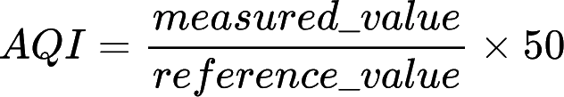

# AQI monitoring for the city of Montréal (Québec, Canada)


[](https://github.com/normcyr/montreal-aqi-api/actions/workflows/ci.yml)


A Python module to fetch and compute the air quality index (AQI) from the City of Montréal's open data platform.

This project is intended for use as a standalone CLI tool or as a library within other applications, such as a Home Assistant custom integration.

## Features

- Fetches the latest air quality data from Montréal's open data portal.
- Returns the AQI contributions of various measured pollutants from a specific station.
- Calculates the concentrations of various pollutants based on their respective reported AQI contribution. [^1]
- Provides an AQI value according to the definition from the Réseau de surveillance de la qualité de l'air (RSQA)
- Lists available air quality monitoring stations.
- Saves raw data to a JSON file for inspection.

[^1]: Until the city of Montréal offers direct access to the concentration of the various pollutants measured, the calculated concentrations are only estimations of the real values. This is because the reported AQI values ared rounded to the nearest integer resulting in a loss of precision.

## Requirements

- Python 3
- `requests` library

## Installation

```bash
git clone https://github.com/normcyr/montreal-aqi-api.git
cd montreal-aqi-api
python3 -m venv venv
source venv/bin/activate
pip install .
```

## Usage

Run the script with the following options:

### Fetch AQI for a specific station

```bash
montreal-aqi --station <station_id>
```

Output:

```bash
2025-08-08 12:10:51,801 - INFO - Montreal AQI API CLI Tool - version 0.2.0
2025-08-08 12:10:51,801 - INFO - Fetching latest data for station 80...
2025-08-08 12:10:52,028 - INFO - Found latest data at 10:00.
2025-08-08 12:10:52,028 - INFO - Using the formula used by the city of Montréal to calculate the pollutant levels
2025-08-08 12:10:52,029 - INFO - The air quality index for station 80 is 49
```

### List available monitoring stations

```bash
montreal-aqi --list
```

Output:

```bash
2025-08-08 12:11:56,488 - INFO - Montreal AQI API CLI Tool - version 0.2.0
2025-08-08 12:11:56,488 - INFO - Fetching list of monitoring stations...
2025-08-08 12:11:56,745 - INFO - Found a list of monitoring stations.
2025-08-08 12:11:56,745 - INFO - {'station_id': '3', 'station_name': 'Saint-Jean-Baptiste ', 'station_address': '1050 A, St-Jean-Baptiste', 'station_borough': 'Rivière-des-Prairies'}
2025-08-08 12:11:56,745 - INFO - {'station_id': '6', 'station_name': 'Anjou', 'station_address': '7650 rue Châteauneuf', 'station_borough': 'Anjou'}
2025-08-08 12:11:56,745 - INFO - {'station_id': '17', 'station_name': 'Caserne 17', 'station_address': '4240 rue Charleroi', 'station_borough': 'Montréal-Nord'}
2025-08-08 12:11:56,746 - INFO - {'station_id': '28', 'station_name': 'Échangeur Décarie', 'station_address': '2495 Duncan', 'station_borough': 'Mont-Royal'}
2025-08-08 12:11:56,746 - INFO - {'station_id': '31', 'station_name': 'Saint-Dominique', 'station_address': '75, rue Ontario Est', 'station_borough': 'Ville-Marie'}
2025-08-08 12:11:56,746 - INFO - {'station_id': '50', 'station_name': 'Hochelaga-Maisonneuve', 'station_address': '3250, Ste-Catherine Est', 'station_borough': 'Hochelaga-Maisonneuve'}
2025-08-08 12:11:56,746 - INFO - {'station_id': '55', 'station_name': 'Rivière-des-Prairies', 'station_address': '12400, Wilfrid-Ouellette, coin Louis-Lumière', 'station_borough': 'Rivière-des-Prairies'}
2025-08-08 12:11:56,746 - INFO - {'station_id': '66', 'station_name': 'Aéroport de Montréal', 'station_address': 'Aéroport de Montréal, 90-A rue Hervé-St-Martin', 'station_borough': 'Dorval'}
2025-08-08 12:11:56,746 - INFO - {'station_id': '80', 'station_name': 'Saint-Joseph', 'station_address': '2580 Saint-Joseph est', 'station_borough': 'Rosemont-La Petite-Patrie'}
2025-08-08 12:11:56,746 - INFO - {'station_id': '99', 'station_name': 'Sainte-Anne-de-Bellevue', 'station_address': '20965, Ch. Ste-Marie', 'station_borough': 'Sainte-Anne-de-Bellevue'}
2025-08-08 12:11:56,746 - INFO - {'station_id': '103', 'station_name': 'York/Roberval', 'station_address': '5398 rue York', 'station_borough': 'Sud-Ouest'}
```

### Enable debug logging

To enable debug logging for more detailed output, use:

```bash
montreal-aqi --debug --station <station_id>
```

Output:

```bash
2025-08-08 12:12:24,380 - INFO - Montreal AQI API CLI Tool - version 0.2.0
2025-08-08 12:12:24,380 - INFO - Fetching latest data for station 80...
2025-08-08 12:12:24,389 - DEBUG - Starting new HTTPS connection (1): donnees.montreal.ca:443
2025-08-08 12:12:24,601 - DEBUG - https://donnees.montreal.ca:443 "GET /api/3/action/datastore_search?resource_id=a25fdea2-7e86-42ac-8301-ca77db3ff17e&limit=1000 HTTP/1.1" 200 None
2025-08-08 12:12:24,604 - INFO - Found latest data at 10:00.
2025-08-08 12:12:24,604 - INFO - Using the formula used by the city of Montréal to calculate the pollutant levels
2025-08-08 12:12:24,604 - DEBUG - Parsed: SO2 (sulfur dioxide): AQI 1 → 10.0 µg/m3
2025-08-08 12:12:24,604 - DEBUG - Parsed: O3 (ozone): AQI 22 → 70.4 µg/m3
2025-08-08 12:12:24,605 - DEBUG - Parsed: NO2 (nitrogen dioxide): AQI 4 → 32.0 µg/m3
2025-08-08 12:12:24,605 - DEBUG - Parsed: PM2.5 (particulate matter, PM2.5): AQI 49 → 34.3 µg/m3
2025-08-08 12:12:24,605 - DEBUG - Highest AQI value: 49
2025-08-08 12:12:24,605 - INFO - The air quality index for station 80 is 49
```

### Run interactively

If no station ID is provided, the script will prompt for input:

```bash
montreal-aqi
Enter Station ID: <station_id>
```

## Technical Data

### Reference Values for Pollutants

The following table lists the reference values for each pollutant used in calculating the Air Quality Index (AQI) for the station data:

| Pollutant     | Full Name               | Reference Value |
|---------------|-------------------------|-----------------|
| SO₂           | Sulfur Dioxide          | 500 µg/m3       |
| CO            | Carbon Monoxide         | 35 mg/m3        |
| O₃            | Ozone                   | 160 µg/m3       |
| NO₂           | Nitrogen Dioxide        | 400 µg/m3       |
| PM (PM2.5)    | Particulate Matter      | 35 µg/m3        |

### AQI Calculation Method

The AQI for each pollutant is calculated using the following formula, as described [in the methodology section](https://donnees.montreal.ca/dataset/rsqa-indice-qualite-air#methodology) of the RSQA website:



where:

- `measured_value` is the concentration of the pollutant in µg/m³ measured at a given time.
- `reference_value` is the predefined reference value for the pollutant (as listed in the table above).
- `AQI` is the calculated air quality index value for that pollutant.

The AQI contribution for each pollutant is calculated individually using the formula above. The reported AQI value at a specific station is the highest of the sub-indices calculated for the pollutants continuously measured at that station. It provides an overall indication of air quality, helping to assess the overall health impact based on the measured pollutants.

The air quality index (AQI) value is defined as follows:

- Good: From 1 to 25
- Acceptable: From 26 to 50
- Poor: 51 or higher

## Data Source

Data is retrieved from the [Ville de Montréal Open Data Portal](https://donnees.montreal.ca/fr/dataset/rsqa-indice-qualite-air).

## License

This project is licensed under the [MIT License](LICENSE).
